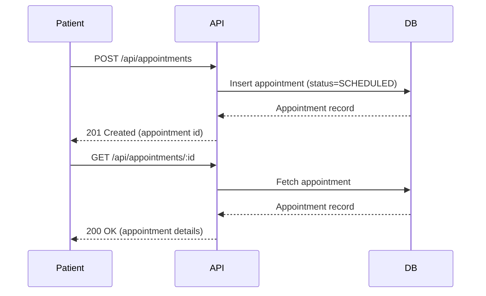

# Skill — Create Design Document

## What You Do
Read the BRD as the primary source of requirements and produce:
- `docs/design/design-doc.md` — complete technical design document

## Steps
1. Read `docs/requirements/BRD.md` — extract domain entity names, user role
   names, lifecycle states, and business rules. These names must be used
   verbatim throughout the design — in data model names, API route paths,
   and component names. The BRD is your authoritative source for functional
   requirements.
2. Read `workshop-stack.md` — extract the target tech stack. Use this to:
   - Generate the Domain Model (Section 2) using the correct ORM or schema
     format for the chosen stack (e.g. SQLAlchemy models, EF Core entities,
     JPA annotations, or the ORM defined in `workshop-stack.md`). If
     `workshop-stack.md` is not yet filled in, describe the data model
     in plain entity-relationship terms.
   - Generate the Component Structure (Section 4) using the correct frontend
     framework conventions (e.g. React functional components, Vue SFCs,
     Angular components).
   - Generate the API Contracts (Section 3) using the folder/route conventions
     defined in `workshop-stack.md` (e.g. `routes_folder`, `controllers_folder`).
   - Reference the correct file extensions and naming patterns throughout.
3. Produce `docs/design/design-doc.md` in the `## Design Doc Format` section below.
4. **Save — handle re-runs correctly:**
   - If `docs/design/design-doc.md` does **not** exist: create it.
   - If it **already exists**: overwrite it with the updated content.
     Do not create duplicate files or numbered versions.

## Design Doc Format

```markdown
# [App Name] — Design Document
**Date:** [Today]
**Source:** BRD.md

## 1. Architecture Overview
Describe the system tiers and how they connect.
Name the layers (e.g. presentation, API, data) without prescribing
specific frameworks or technologies.
Include a Mermaid diagram.

## 2. Domain Model
Describe each entity from the BRD, its fields, states, and relationships.
Include a Mermaid ER diagram.
If `workshop-stack.md` defines an ORM (e.g. SQLAlchemy, EF Core, JPA,
or any other ORM), represent schema definitions in that ORM's syntax
alongside the ER diagram.
If `workshop-stack.md` is not yet filled in, describe the model in
plain entity-relationship terms only.

## 3. API Contracts
| Method | Path | Description | Auth Required |
|--------|------|-------------|---------------|

Include request and response shapes for complex endpoints.
Define error response shape: { error: string } with correct HTTP status.

## 4. Component Structure
Describe the UI component hierarchy.
Include a Mermaid diagram of the component tree.
Include test identifiers (e.g. data-testid values) for all
interactive elements — these must match what the developer implements
and what tests reference.

## 5. Key User Flows
Mermaid sequence diagram for each primary user journey end to end.

## 6. Seed Data Plan
For each domain entity, describe the seed records needed to demonstrate
the feature. Include at least one record per status or type variant
defined in the BRD.
```

## Domain Model Rules
- **Domain fidelity** — entity names must match the BRD entity names exactly.
  Use the name the BRD uses — do not substitute a generic equivalent.
  (e.g. if the BRD says `Appointment`, the entity is `Appointment` —
  not `Booking` or `Event`)
- **Lifecycle states** — every entity with a lifecycle must have its states
  defined as a fixed set of values, not free-form strings.
  Define the full state list for each such entity.
  (e.g. Status: SCHEDULED | CONFIRMED | COMPLETED | CANCELLED)
- **Enums** — every categorical field with a fixed set of values must be
  defined as an enumerated type. Never leave categorical fields as
  open-ended strings.
- **Relations** — every relationship must have both sides defined with
  cardinality (one-to-many, many-to-many, etc.)
- **Business rules** — constraints from the BRD (e.g. capacity limits,
  approval gates, uniqueness rules) must be reflected in the model.
  Do not defer them to "application logic" without defining them here.

## API Design Rules
- **Domain fidelity** — route path nouns must match BRD entity names.
  (e.g. if the BRD entity is `Appointment`, use `/api/appointments` —
  not `/api/bookings`)
- RESTful conventions — nouns not verbs.
- Protected routes explicitly marked.
- Response shapes documented for complex endpoints.
- Query parameters listed for all filterable endpoints.
- Error responses: derive the error response shape from `workshop-stack.md`
  → `api_error_format` if defined; otherwise use the stack's conventional
  error shape:
  - Express / Node.js: `{ error: string }`
  - FastAPI / Python: `{ detail: string }`
  - Spring Boot / Java: `{ message: string, status: int, timestamp: string }`
  - ASP.NET Core / C#: `{ title: string, status: int, traceId: string }`
  Always document the chosen shape explicitly in the API contracts section.

## Component Design Rules
- Every interactive element must have a test identifier attribute
  (e.g. `data-testid`).
- Document the identifier value in the component tree.
- This is required for automated tests to reference elements reliably.
- Component names must reflect the BRD domain language —
  not generic names like `ItemCard` or `ListPage`.
  (e.g. `AppointmentCard`, `BookingList`, `PractitionerProfile`)

## Seed Data Rules
- Derive seed data requirements from the BRD functional requirements
  and domain entities.
- Include at least 3-5 realistic sample records per domain entity
  to demonstrate the feature end to end.
- At least one record of each status or type variant must be present.
  (e.g. if the BRD defines different booking states, include one
  example of each state)
- Missing seed data causes blank pages and test failures — be complete.

## Diagrams to Always Include
1. **Architecture overview** — system tiers and how they connect.
2. **ER diagram** — all entities and relationships with cardinality.
3. **Component tree** — UI hierarchy with test identifier values.
4. **Sequence diagram** — primary user journey end to end.

## Mermaid Syntax Rules — MUST Follow
These rules prevent parse errors when diagrams are rendered.

- **No double quotes in labels** — sequence diagram arrow labels cannot
  contain `"`. Summarise instead.
  Bad:  `API-->>FE: 200 filename="data.csv"`
  Good: `API-->>FE: 200 OK (file download)`
- **Keep labels short** — do not paste full HTTP headers into arrow labels.
- **No colons inside a label after the first colon** — the first `:` separates
  the arrow target from the label; subsequent colons can confuse parsers.
  Use parentheses instead:
  Good: `API-->>FE: 200 OK (text/csv)`
- **No semicolons in labels** — replace with a comma or omit.
- **Participant aliases must not contain spaces or special characters** —
  use CamelCase or underscores.
  Good: `participant FE as Frontend`
- **Validate mentally before writing** — check each arrow label contains
  no `"`, `;`, or multiple `:` characters.

## Traceability Requirement
Every section of the design must trace back to a BRD functional requirement.
Use FR IDs (e.g. FR-001) to annotate design decisions where relevant.
This ensures nothing is designed that was not required, and nothing
required is left undesigned.

## Do Not Do This
- Do NOT prescribe a specific framework, ORM, or library in the design document
  **unless it is already defined in `workshop-stack.md`**. If the stack is defined,
  use its ORM/framework syntax in the data model and component structure sections.
  If the stack is not yet defined, describe patterns and contracts only
  (e.g. say "the data layer exposes a repository interface" — not the specific ORM name).
- Do NOT rename domain entities to generic equivalents.
- Do NOT reduce a complex domain model to a simple CRUD pattern unless
  the BRD actually describes that.
- Do NOT leave lifecycle states or business rules as implementation details —
  they belong in the design document explicitly.
- Do NOT design features not present in the BRD — scope is defined there.

## Example — Domain Model Entry

For a BRD entity `Appointment` with lifecycle
`Scheduled → Confirmed → Completed | Cancelled`:

```
### Appointment
| Field       | Type     | Notes                              |
|-------------|----------|------------------------------------|
| id          | Integer  | Primary key                        |
| patientId   | Integer  | FK → Patient                       |
| practitionerId | Integer | FK → Practitioner                 |
| status      | Enum     | SCHEDULED, CONFIRMED, COMPLETED,   |
|             |          | CANCELLED                          |
| scheduledAt | DateTime |                                    |
| createdAt   | DateTime |                                    |

Business rules:
- A Referral must exist before status can move to CONFIRMED (FR-005)
- Only the Patient may cancel a SCHEDULED Appointment (FR-006)
- Status transitions: SCHEDULED → CONFIRMED → COMPLETED
                      SCHEDULED → CANCELLED
```

## Example — Sequence Diagram (Correct Syntax)


